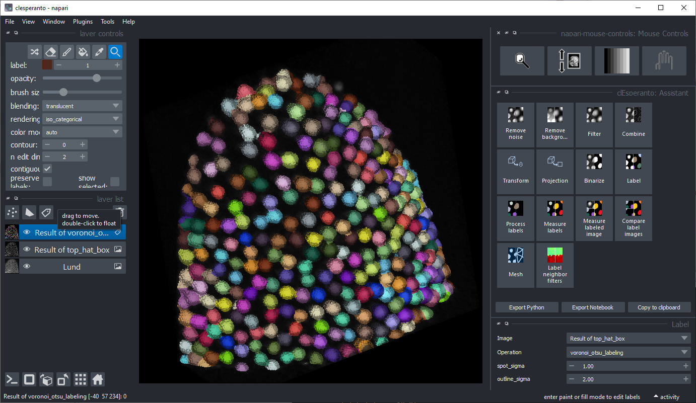

# clesperanto
[](https://forum.image.sc/tag/clesperanto)
[](http://clesperanto.net)
[](https://pypi.org/project/clesperanto)
[](https://github.com/haesleinhuepf/clesperanto/raw/main/LICENSE)
[](https://python.org)

clesperanto is a graphical user interface for [clEsperanto](http://clesperanto.net) - a multi-platform multi-language framework for GPU-accelerated image processing.
It is based on [napari](https://github.com/napari/napari) and the [pyclesperanto-prototype](https://github.com/clesperanto/pyclesperanto_prototype).

## Installation
* Get a python environment, e.g. via [mini-conda](https://docs.conda.io/en/latest/miniconda.html). If you never used python/conda environments before, please follow the instructions [here](https://mpicbg-scicomp.github.io/ipf_howtoguides/guides/Python_Conda_Environments) first.
* Install [pyopencl](https://documen.tician.de/pyopencl/) and [napari](https://github.com/napari/napari) using conda (seriously, don't use pip here, at least on Windows). 

```
conda install -c conda-forge pyopencl napari
```

Afterwards, install `clesperanto` using pip:

```
pip install clesperanto
```

## Usage

You can then start clesperanto from the command line:
```
cle
```




## Documentation

clesperanto installs multiple napari plugins. Check out their documentation for details

* [The clesperanto assistant](https://www.napari-hub.org/plugins/napari-pyclesperanto-assistant)
* [Accelerated pixel and object classification](https://www.napari-hub.org/plugins/napari-accelerated-pixel-and-object-classification)
* [Brightness/contrast](https://www.napari-hub.org/plugins/napari-brightness-contrast)
* [Mouse controls](https://www.napari-hub.org/plugins/napari-mouse-controls)
* [Plot profile](https://www.napari-hub.org/plugins/napari-plot-profile)
* [Scikit-image's regionprops](https://www.napari-hub.org/plugins/napari-skimage-regionprops)
* [Segment blobs and things with membranes](https://www.napari-hub.org/plugins/napari-segment-blobs-and-things-with-membranes)
* [Multi-viewer support](https://www.napari-hub.org/plugins/napari-tabu)
* [Cropping](https://www.napari-hub.org/plugins/napari-crop)

## Feedback welcome!
clesperanto is developed in the open because we believe in the open source community. See our [community guidelines](https://clij.github.io/clij2-docs/community_guidelines). Feel free to drop feedback as [github issue](https://github.com/clEsperanto/pyclesperanto_prototype/issues) or via [image.sc](https://image.sc)
